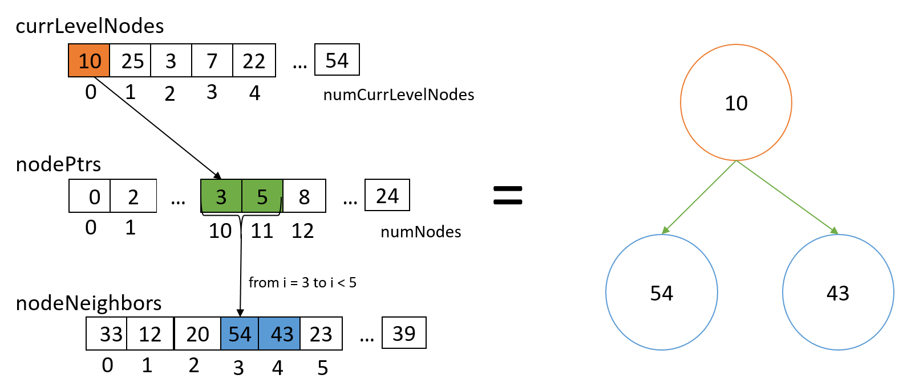

# Breadth First Search

## Objective 
The purpose of this lab is to understand hierarchical queuing in the context of the breadth first search algorithm as an example. You will implement a single iteration of breadth first search that takes aset of nodes in the current level (also called wave-front) as input and outputs the set of nodes belonging to the next level.

## Functions

In this lab, you must implement three versions of the BFS kernel: one
using only a global queue, a second using both block and global queues,
and a third using warp, block, and global queues.

All three functions take the same seven arguments (not in the order below,
but that doesn't matter):

* `numCurrLevelNodes` is a pointer to the number of nodes in the current
frontier--the one to be processed by your kernel.
* `currLevelNodes` is the current frontier stored as an array of 
`*numCurrLevelNodes` unsigned integers.
* `numNextLevelNodes` is a pointer to the number of nodes in the frontier
produced by your kernel.  You may assume that the value at this address
has been initialized to 0.
* `nextLevelNodes` is the frontier produced by your kernel, stored as
an array of unsigned integers (node numbers).  In other words, the
global queue.  You may assume that this queue has enough space for the
entire frontier produced (but no more--do not use extra space).
* `nodePtrs` is an array of unsigned integers indexed by node number.
This array keeps track of the indices into the `nodeNeighbors` array for
each node in the graph.
You do not need to know the length of the array, as you may assume that
any node number stored in the current frontier is a valid index into 
this array.
* `nodeNeighbors` is an array of unsigned integers holding the indices
of neighboring nodes for all nodes in the graph.  Its use is explained
by example below, but follows the CSR approach discussed in lecture.
* `nodeVisited` is an array of binary-valued unsigned integers indexed
by node number.  The value 0 means that a node has not been visited and
should be added to the next frontier.  The value 1 means that a node
has been visited and should not be added (or already is/will be present) 
to the frontier.  Again, you do not need to know the length of this
array, as you may assume that any node number stored in the 
list of a node's neighbors is a valid index into this array.

## Input Arrays

The image below illustrates how the input arrays are used in the code:

## Input Informantion

The template code reads three input arrays:
 
`nodePtrs` is an array of unsigned integers that contains indices into 
the `nodeNeighbors` array for each node in the graph.
For example, you can use this array to loop through all neighbors of 
node 1 as follows:

    for (unsigned int nbrIdx = nodePtrs[1]; nbrIdx < nodePtrs[2]; ++nbrIdx) {
        ...
    }

`nodeNeighbors` is an array of unsigned integers that stores the node 
numbers of all neighbors for all nodes.  
For example, to mark all neighbors of node 1 as visited, we can add two 
lines to the code above as shown here:

    for (unsigned int nbrIdx = nodePtrs[1]; nbrIdx < nodePtrs[2]; ++nbrIdx) {
        unsigned int neighborID = nodeNeighbors[nbrIdx];
        nodeVisited[neighborID] = 1;
    }

`currLevelNodes` is the current frontier stored as an array of 
`numCurrLevelNodes` unsigned integers.
also an integer array, from  0  to numCurrLevelNodes, which keep track of the current frontier.  This array is the starting point of your BFS. To loop through the current frontier can bedone as follows:

    for (unsigned int idx = 0; idx < numCurrLevelNodes; ++idx) {
        unsigned int node = currLevelNodes[idx];
    }

The image above shows how the arrays interact together to represent how nodes are linked together.

## Procedure 
1. Edit the file template.cu` to implement three versions of the BFS kernels: 

* Edit the kernel `gpu_global_queuing_kernel` in the file to implement the algorithm using just a global queue. Test by running ./bfs gq
* Edit the kernel `gpu_block_queuing_kernel` in the file to implement the algorithm using block and global queuing. Test by running ./bfs bq
* Edit the kernel `gpu_warp_queueing_kernel` in the file to implement the algorithm using warp, block, and global queuing. Test by running ./bfs wq

2. Test your code using rai

    `rai -p <bfs folder>`

    Be sure to add any additional flags that are required by your course (`--queue` or others).

3. Submit your code on rai
