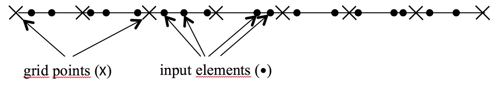
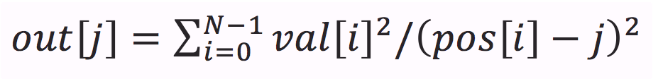

## Objective

The purpose of this lab is to understand input binning and its impact on performance in the context of a simple computation example. The example is composed of a 1-dimensional grid of (discrete) points and an array of elements each having a non-discrete value and a non-distinct position in the grid as shown in the following figure

In this example, we would like to compute the total impact of all the input elements on each of the output elements. The total impact on a single output grid point is computed as follows:

## Instructions

Edit the kernel `gpu_cutoff_binned_kernel` to implement the computation on the GPU --- the number of bins has been fixed to `1024` so that scan operations can be performed in a single thread block. The kernels `histogram`, `scan`, and `sort` must be edited to perform the appropriate operations for input binning. You must loop over the bins and for each bin check if either of its bounds is within the cutoff range. If yes, you must loop over the input elements in the bin, check if each element is within the cutoff range, and if yes include it in your computation.

Instructions about where to place each part of the code is
demarcated by the `//@@` comment lines.

## Helper Functions

### Error Checks

### Timer

### Verification
