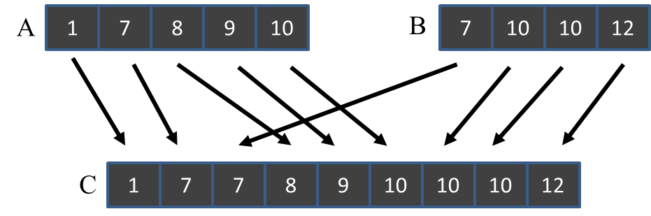

# Parallel Merge

### Objective
Merge operation is an important operation in sorting algorithms. In this lab, you'll write kernels for merging two sorted arrays.



An ordered merge function takes two sorted list (or array) A and B and merges them into a single sorted list C. The kernel template code follows the definition of ordered merge. Inputs are array A, B and their corresponding array lengths. The output is array C, which is a pre-allocated array of total length.

You are required to implement the basic parallel merge and tiled parallel merge:
 - **`gpu_basic_merge` (REQUIRED)**: Each thread is responsible for an output range. Each thread then uses *co-rank* function and its output range to determine the two input ranges that needs to be merged. Once input and output ranges are identified, threads can independently perform the sequential merge in parallel.

 - **`gpu_tiled_merge` (REQUIRED)**: Kernel will use shared memory to improve the reuse of input and coalescing pattern. Unlike the basic kernel where threads handles different output ranges, tiled merge kernel divide input and output ranges on block level. Threads in a block collaboratively load inputs to shared memory and perform merge operation. This should reduce the irregular memory access pattern in basic merge kernel.

 - **`gpu_circular_buffer_merge` (OPTIONAL)**: An extra optimization is using circular buffer to increase the utilization of shared memory. The idea is similar to tiled merge kernel, but the `co_rank` and `sequential_merge` functions have to be changed to support circular buffer. The complexity in terms of code will increase significantly. You can get extra credit if you can  implement it correctly.

In the template you'll find a sequential merge function `merge_sequential` already given. `ceil_div` function is also provided if you need to divide two integers and round up the result to the next integer.

You should implement the co-rank function as it will be needed in your parallel merge kernels.

### Running the code
 By default, `rai_build.yml` builds and runs the two required kernel and check against reference solution.

If you plan to work on extra credit (`gpu_circular_buffer_merge`), remove the argument `required` when running merge so all kernels will be tested. Then the build commands in `rai_build.yml` should look like the following:
```
...
...
commands:
  build:
    - cp -r /src .
    - cmake /src
    - make
    - ./merge
```
